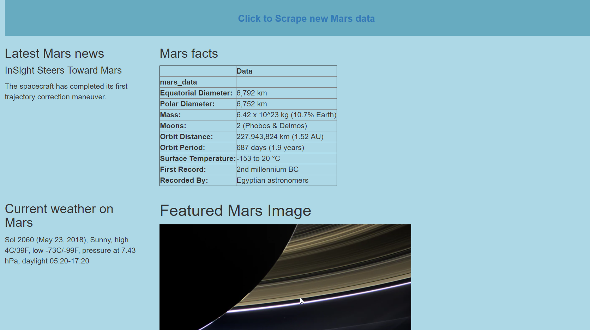

```python
from IPython.display import Image
```


```python
Image(filename='Mars_localhost5000page.png')
```





```python
import pandas as pd
import numpy as np

from bs4 import BeautifulSoup
import pymongo
from splinter import Browser
import requests
import time

from selenium import webdriver
import requests
import re

```


```python
executable_path = {'executable_path': 'chromedriver.exe'}
browser = Browser('chrome', **executable_path, headless=False)

```


```python
marsurl = "https://mars.nasa.gov/news/"

browser.visit(marsurl)
time.sleep(1)

```


```python
html = browser.html

soup = BeautifulSoup(html,'html.parser')
```


```python
#print(soup.prettify())
```


```python
# Get the first title by returning div element the class = content_title 

news_title = soup.find('div', class_='content_title').text
```


```python
news_p = soup.find('div', class_="rollover_description_inner").text
```


```python
print("-"*25)
print("The latest Mars news is:",news_title)
print("The summary of this latest news is:",news_p)
```

    -------------------------
    The latest Mars news is: InSight Steers Toward Mars
    The summary of this latest news is: The spacecraft has completed its first trajectory correction maneuver.
    


```python
#JPL Mars Space Images - Featured Image

jpl_url = "https://www.jpl.nasa.gov/spaceimages/?search=&category=Mars"
browser.visit(jpl_url)
```


```python
# Scrape the browser into soup and use soup
# Save the image url 
html = browser.html
jplsoup = BeautifulSoup(html, 'html.parser')
image_url = jplsoup.find('a', {'id': 'full_image', 'data-fancybox-href': True}).get('data-fancybox-href')
image_url
```


    '/spaceimages/images/mediumsize/PIA16763_ip.jpg'


```python
# Get the url
jpl_logo_href = jplsoup.find_all('div', class_='jpl_logo')
print(jpl_logo_href)
```

    [<div class="jpl_logo">
    <a href="//www.jpl.nasa.gov/" id="jpl_logo" title="Jet Propulsion Laboratory">Jet Propulsion Laboratory</a>
    </div>, <div class="jpl_logo">
    <a class="" href="" id="jpl_logo" title="">Jet Propulsion Laboratory</a>
    </div>]
    


```python
# Create BeautifulSoup object; parse with 'html.parser'
html_page = browser.html
jplsoup = BeautifulSoup(html_page, "lxml")
```


```python
# Get all the hrefs of the url
links = []
for link in jplsoup.find_all('a'):
    links.append(link.get('href'))
 
```


```python

# Retrieve the href in the list 
jpl_link = links[1].strip('/')
print(jpl_link)
```

    www.jpl.nasa.gov
    


```python

featured_image_url = "https://"+jpl_link+image_url
print(featured_image_url)
```

    https://www.jpl.nasa.gov/spaceimages/images/mediumsize/PIA16763_ip.jpg
    


```python
#Mars Weather
twitter_url = "https://twitter.com/marswxreport?lang=en"
browser.visit(twitter_url)

```


```python
html = browser.html
twittersoup = BeautifulSoup(html, 'html.parser')
```


```python
weather = twittersoup.find('p', class_='TweetTextSize TweetTextSize--normal js-tweet-text tweet-text')
weather
```


    <p class="TweetTextSize TweetTextSize--normal js-tweet-text tweet-text" data-aria-label-part="0" lang="en">Sol 2060 (May 23, 2018), Sunny, high 4C/39F, low -73C/-99F, pressure at 7.43 hPa, daylight 05:20-17:20</p>


```python
mars_weather = weather.text.strip()
mars_weather
```


    'Sol 2060 (May 23, 2018), Sunny, high 4C/39F, low -73C/-99F, pressure at 7.43 hPa, daylight 05:20-17:20'


```python
#Mars Facts

marsfacts_url = "https://space-facts.com/mars/"
browser.visit(marsfacts_url)
```


```python
html = browser.html
mars_facts = BeautifulSoup(html, 'html.parser')
```


```python

# Convert to a pandas df
marsdf = pd.read_html(marsfacts_url)
marsfactsdf = pd.DataFrame(marsdf[0])
```


```python
# Define the columns and set the index.  
marsfactsdf.columns = ['Characteristic','Data']
marsdf1 = marsfactsdf.set_index("Characteristic")
marsdf1
```


<div>
<style scoped>
    .dataframe tbody tr th:only-of-type {
        vertical-align: middle;
    }

    .dataframe tbody tr th {
        vertical-align: top;
    }

    .dataframe thead th {
        text-align: right;
    }
</style>
<table border="1" class="dataframe">
  <thead>
    <tr style="text-align: right;">
      <th></th>
      <th>Data</th>
    </tr>
    <tr>
      <th>Characteristic</th>
      <th></th>
    </tr>
  </thead>
  <tbody>
    <tr>
      <th>Equatorial Diameter:</th>
      <td>6,792 km</td>
    </tr>
    <tr>
      <th>Polar Diameter:</th>
      <td>6,752 km</td>
    </tr>
    <tr>
      <th>Mass:</th>
      <td>6.42 x 10^23 kg (10.7% Earth)</td>
    </tr>
    <tr>
      <th>Moons:</th>
      <td>2 (Phobos &amp; Deimos)</td>
    </tr>
    <tr>
      <th>Orbit Distance:</th>
      <td>227,943,824 km (1.52 AU)</td>
    </tr>
    <tr>
      <th>Orbit Period:</th>
      <td>687 days (1.9 years)</td>
    </tr>
    <tr>
      <th>Surface Temperature:</th>
      <td>-153 to 20 °C</td>
    </tr>
    <tr>
      <th>First Record:</th>
      <td>2nd millennium BC</td>
    </tr>
    <tr>
      <th>Recorded By:</th>
      <td>Egyptian astronomers</td>
    </tr>
  </tbody>
</table>
</div>


```python
# Convert the pd df to HTML table
marshtml_table = marsdf1.to_html(classes='marsdata')
mars_table = marshtml_table.replace('\n', ' ')
mars_table
```


    '<table border="1" class="dataframe marsdata">   <thead>     <tr style="text-align: right;">       <th></th>       <th>Data</th>     </tr>     <tr>       <th>Characteristic</th>       <th></th>     </tr>   </thead>   <tbody>     <tr>       <th>Equatorial Diameter:</th>       <td>6,792 km</td>     </tr>     <tr>       <th>Polar Diameter:</th>       <td>6,752 km</td>     </tr>     <tr>       <th>Mass:</th>       <td>6.42 x 10^23 kg (10.7% Earth)</td>     </tr>     <tr>       <th>Moons:</th>       <td>2 (Phobos &amp; Deimos)</td>     </tr>     <tr>       <th>Orbit Distance:</th>       <td>227,943,824 km (1.52 AU)</td>     </tr>     <tr>       <th>Orbit Period:</th>       <td>687 days (1.9 years)</td>     </tr>     <tr>       <th>Surface Temperature:</th>       <td>-153 to 20 °C</td>     </tr>     <tr>       <th>First Record:</th>       <td>2nd millennium BC</td>     </tr>     <tr>       <th>Recorded By:</th>       <td>Egyptian astronomers</td>     </tr>   </tbody> </table>'


```python
#Mars Hemisperes

marshemispheres_url = "https://astrogeology.usgs.gov/search/results?q=hemisphere+enhanced&k1=target&v1=Mars"
browser.visit(marshemispheres_url)


```


```python
html = browser.html
mars_hemispheres = BeautifulSoup(html, 'html.parser')
```


```python
# Get the div element that holds the images. 
images = mars_hemispheres.find('div', class_='collapsible results')
print(images.prettify())
```

    <div class="collapsible results">
     <div class="item">
      <a class="itemLink product-item" href="/search/map/Mars/Viking/cerberus_enhanced">
       
      </a>
      <div class="description">
       <a class="itemLink product-item" href="/search/map/Mars/Viking/cerberus_enhanced">
        <h3>
         Cerberus Hemisphere Enhanced
        </h3>
       </a>
       <span class="subtitle" style="float:left">
        image/tiff 21 MB
       </span>
       <span class="pubDate" style="float:right">
       </span>
       <br/>
       <p>
        Mosaic of the Cerberus hemisphere of Mars projected into point perspective, a view similar to that which one would see from a spacecraft. This mosaic is composed of 104 Viking Orbiter images acquired…
       </p>
      </div>
      <!-- end description -->
     </div>
     <div class="item">
      <a class="itemLink product-item" href="/search/map/Mars/Viking/schiaparelli_enhanced">
       
      </a>
      <div class="description">
       <a class="itemLink product-item" href="/search/map/Mars/Viking/schiaparelli_enhanced">
        <h3>
         Schiaparelli Hemisphere Enhanced
        </h3>
       </a>
       <span class="subtitle" style="float:left">
        image/tiff 35 MB
       </span>
       <span class="pubDate" style="float:right">
       </span>
       <br/>
       <p>
        Mosaic of the Schiaparelli hemisphere of Mars projected into point perspective, a view similar to that which one would see from a spacecraft. The images were acquired in 1980 during early northern…
       </p>
      </div>
      <!-- end description -->
     </div>
     <div class="item">
      <a class="itemLink product-item" href="/search/map/Mars/Viking/syrtis_major_enhanced">
       
      </a>
      <div class="description">
       <a class="itemLink product-item" href="/search/map/Mars/Viking/syrtis_major_enhanced">
        <h3>
         Syrtis Major Hemisphere Enhanced
        </h3>
       </a>
       <span class="subtitle" style="float:left">
        image/tiff 25 MB
       </span>
       <span class="pubDate" style="float:right">
       </span>
       <br/>
       <p>
        Mosaic of the Syrtis Major hemisphere of Mars projected into point perspective, a view similar to that which one would see from a spacecraft. This mosaic is composed of about 100 red and violet…
       </p>
      </div>
      <!-- end description -->
     </div>
     <div class="item">
      <a class="itemLink product-item" href="/search/map/Mars/Viking/valles_marineris_enhanced">
       
      </a>
      <div class="description">
       <a class="itemLink product-item" href="/search/map/Mars/Viking/valles_marineris_enhanced">
        <h3>
         Valles Marineris Hemisphere Enhanced
        </h3>
       </a>
       <span class="subtitle" style="float:left">
        image/tiff 27 MB
       </span>
       <span class="pubDate" style="float:right">
       </span>
       <br/>
       <p>
        Mosaic of the Valles Marineris hemisphere of Mars projected into point perspective, a view similar to that which one would see from a spacecraft. The distance is 2500 kilometers from the surface of…
       </p>
      </div>
      <!-- end description -->
     </div>
     <script>
      addBases=[];;if(typeof resetLayerSwitcher==="function"){resetLayerSwitcher(false)};var productTotal = 4;
     </script>
    </div>
    
    


```python
hemispheres_image_urls = []

for i in range(len(images.find_all("div", class_="item"))):
    time.sleep(5)
    image = browser.find_by_tag('h3')
    image[i].click()
    html = browser.html
    soup = BeautifulSoup(html, 'html.parser')
    title = soup.find("h2", class_="title").text
    div = soup.find("div", class_="downloads")
    for li in div:
               link = div.find('a')
    url = link.attrs['href']
    hemispheres = {
            'title' : title,
            'img_url' : url
        }
    hemispheres_image_urls.append(hemispheres)
    browser.back()
```


```python
hemispheres_image_urls
```


    [{'img_url': 'http://astropedia.astrogeology.usgs.gov/download/Mars/Viking/cerberus_enhanced.tif/full.jpg',
      'title': 'Cerberus Hemisphere Enhanced'},
     {'img_url': 'http://astropedia.astrogeology.usgs.gov/download/Mars/Viking/schiaparelli_enhanced.tif/full.jpg',
      'title': 'Schiaparelli Hemisphere Enhanced'},
     {'img_url': 'http://astropedia.astrogeology.usgs.gov/download/Mars/Viking/syrtis_major_enhanced.tif/full.jpg',
      'title': 'Syrtis Major Hemisphere Enhanced'},
     {'img_url': 'http://astropedia.astrogeology.usgs.gov/download/Mars/Viking/valles_marineris_enhanced.tif/full.jpg',
      'title': 'Valles Marineris Hemisphere Enhanced'}]


